# {TD/TP_NAME}
Nom Prénom
Nom Prénom

**Version de PostgreSQL : 11**

# Requête 1
`EXPLAIN SELECT * FROM realisateur where ID=2800;`

## Sans Index
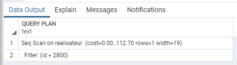

Recherche séquentielle dans la table, car aucun Index.

# Avec Index
`CREATE UNIQUE INDEX IDX_REALISATEUR_ID ON REALISATEUR(ID);`

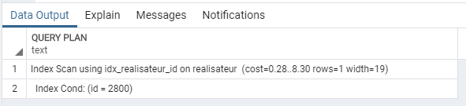

Accès direct, requête 14 fois plus rapide grâce à l'index sur la colonne ID, colonne qui contient notre critère de recherche.
Dans l'exemple précédent, l'Index n'avait aucun effet car on souhaitait récupérer toutes les entrées de la table, ici on cherche une entrée en particulier, donc l'Index est adapté et très intéressant.

# Requête 2
`EXPLAIN SELECT * FROM realisateur where ID=2800 AND NOM ='spielberg';`

## Sans Index
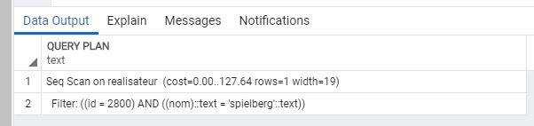

Comme pour la requête précédente, pas d'Index, donc recherche séquentielle.

# Avec Index
`CREATE UNIQUE INDEX IDX_REALISATEUR_ID ON REALISATEUR(ID);`

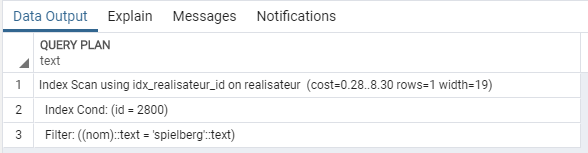

Recherche par accès direct, même gain que précédemment (14 fois plus rapide). L'Index sur l'une des colonnes ciblée par notre condition remplit son rôle.

# Avec Index
`CREATE INDEX IDX_REALISATEUR_NOM ON REALISATEUR(NOM)`

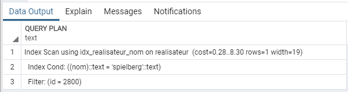

Aucun nouveau gain, la recherche est faite sur l'Index `ID` (le plus petit en taille), et le SGBD vérifie ensuite la deuxième condition, sur le résultat qu'il a trouvé. L'ordre de création des Index ne change rien, le SGBD choisit toujours le même Index dans ce cas.

# Requête 3
`EXPLAIN SELECT * FROM realisateur where ID=2800 OR NOM ='spielberg';`

## Sans Index
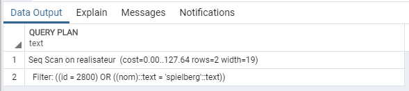

Recherche séquentielle, encore une fois car aucun Index n'est présent alors que l'on filtre sur certaines valeurs (ici, deux valeurs).

# Avec Index
`CREATE UNIQUE INDEX IDX_REALISATEUR_ID ON REALISATEUR(ID);`

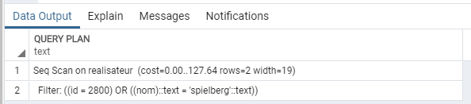

Le condition contient un `OR`, donc le SGBD, voyant qu'une seule colonne est indexée (et qu'il va devoir tout parcourir pour les valeurs de la deuxième colonne), effectue une recherche séquentielle lors de laquelle il récupère les deux valeurs dans les deux colonnes.

# Avec Index
`CREATE INDEX IDX_REALISATEUR_NOM ON REALISATEUR(NOM);`

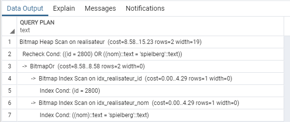

Les deux colonnes sont désormais indexées, notre recherche est donc extrêmement plus rapide, avec un accès direct grâce aux Indexes Bitmap

# Requête 4
`EXPLAIN SELECT * FROM realisateur where ID>1000;`

## Sans Index
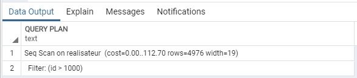

Recherche séquentielle, même temps que pour les recherches sans Index précédentes.

# Avec Index
`CREATE UNIQUE INDEX IDX_REALISATEUR_ID ON REALISATEUR(ID);`

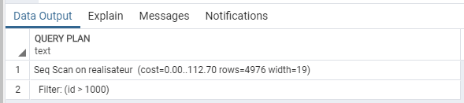

Recherche séquentielle, car on cherche à récupérer une majeure partie des données (et donc plus de 30%). Dans ce cas, la recherche séquentielle est plus efficace que de parcourir toutes les entrées de 1000 à 5900, une par une, en passant par l'Index à chaque fois.

# Requête 5
`EXPLAIN SELECT * FROM realisateur where ID>4000;`

# Avec Index
`CREATE UNIQUE INDEX IDX_REALISATEUR_ID ON REALISATEUR(ID);`

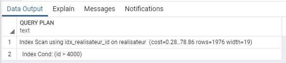

Accès direct, utilisation de l'Index, qui s'explique par le fait que l'on récupère moins de 30% des données de la table. Cependant, le gain de performances n'est pas aussi important que ce que nous avons pu avoir par le passé, car l'on parcourt quand même un nombre important d'entrées.

# Requête 6
`EXPLAIN SELECT * FROM TITRES WHERE titre = 'Char';`

## Sans Index

Recherche séquentielle (car aucun Index), coût très élevé (20 000 entrées dans cette table).

# Avec Indexes
`CREATE UNIQUE INDEX IDX_TITRES ON TITRES(id_film, titre, langue);`
`CREATE UNIQUE INDEX IDX_TITRES ON TITRES(titre, id_film, langue);`
`CREATE INDEX IDX_TITRES_TITRE ON TITRES(titre);`

Avec le premier Index, aucun gain de temps/coût, car PostgreSQL ne semble pas capable d'utiliser un Index si la colonne qui l'intéresse n'est pas la première de celui-ci. Cependant, quand c'est le cas, c'est aussi efficace que d'avoir un Index seulement sur le champ recherché. On peut donc supposer que ce SGBD utilise cet Index « Composé » tel un Index « Classique ».

# Requêtes 7
`EXPLAIN SELECT * FROM TITRES WHERE titre = 'Char' AND ID_FILM=1000;`
`EXPLAIN SELECT * FROM TITRES WHERE titre = 'Char' OR ID_FILM=1000;`

# Avec Index
`CREATE UNIQUE INDEX IDX_TITRES ON TITRES(id_film, titre, langue);`

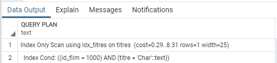
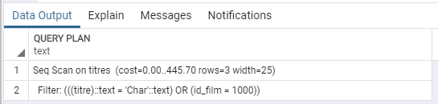

Lorsque l'on a un `AND` dans la condition, et que l'une des colonnes concernées par cet opérateur est la première de l'Index, on obtient un temps d'exécution très rapide. En revanche, avec le `OR`, une recherche séquentielle est effectuée, car l'une des deux colonnes concernées par la condition est en seconde position dans l'Index que l'on a créé. PostgreSQL n'est pas capable d'utiliser cette « partie » de l'Index.

# Requête 8
`EXPLAIN SELECT * FROM realisateur WHERE substr(nom,1,2) = 'Sp';`

## Sans Index
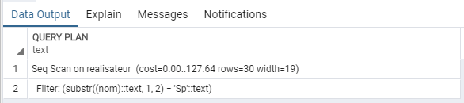

Recherche séquentielle à travers toute la table, car aucun Index.

# Avec Index
`CREATE INDEX IDX_REALISATEUR_NOM ON REALISATEUR(NOM);`

Ici, un Index a été créé, cependant, il n'est pas utilisé car notre `WHERE` est réalisé sur une fonction, fonction qui elle même utilise la table en question.

# Avec Index
`CREATE INDEX IDX_REALISATEUR_SUBSTR_NOM ON realisateur(substr(nom,1,2));`

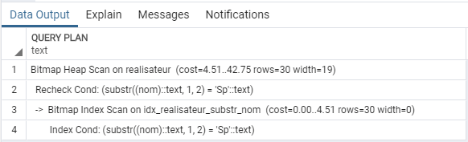

L'Index créé sur la fonction remplit son rôle, et la requête s'exécute beaucoup plus rapidement grâce à lui. On notera donc que lorsqu'on utilise une fonction, il faut faire un Index sur cette fonction.

# Requête 9
`EXPLAIN SELECT t.* FROM Film f JOIN Titres t ON f.id = t.id_film;`

## Sans Index
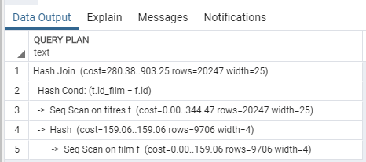

Hash Join sur une double recherche séquentielle. On récupère toutes les entrées des tables, donc temps d'exécution maximal.

# Avec Index
`CREATE UNIQUE INDEX IDX_FILM_ID ON FILM(id);`

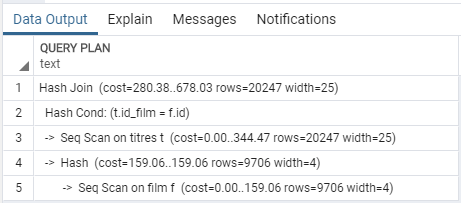

Gain de temps d'exécution léger, qui peut s'expliquer par le fait que l'une des deux recherches séquentielles peut désormais utiliser un Index.

# Avec Index
`CREATE INDEX IDX_TITRES_ID_FILM ON TITRES(id_film);`

Aucun gain de temps. Volume des données retourné trop important, le SGBD utilise la recherche séquentielle et non pas l'Index (ce serait pire).

# Requête 10
`EXPLAIN SELECT t.* FROM Film f JOIN Titres t ON f.id = t.id_film WHERE f.id=2800;`

## Sans Index
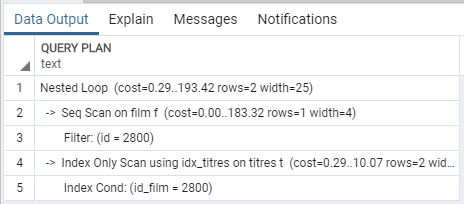

Recherche séquentielle, car on sélectionne un élément spécifique et que l'on a pas d'Index.

# Avec Index
`CREATE INDEX IDX_TITRES_ID_FILM ON TITRES(id_film);`

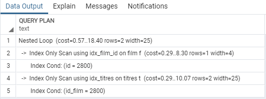

Temps d'exécution beaucoup plus rapide grâce à l'Index sur `ID`. 

# Avec Index
`CREATE INDEX IDX_TITRES_ID_FILM ON TITRES(id_film);`

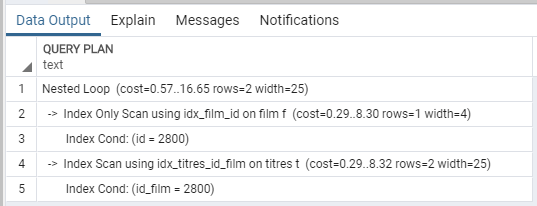

Le temps d'exécution de la requête s'améliorer légèrement grâce à un Index sur `ID` dans la table `TITRES`, ce champ et cette table étant utilisés dans la jointure.

# Requête 11
`EXPLAIN SELECT * FROM films1995;`

## Sans Index
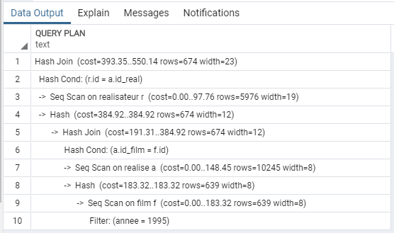

Cette requête retourne 600 résultats. Cependant, elle semble vraiment mal optimisée, car elle contient deux recherches séquentielles de 6000 et 10000 lignes respectivement. Il semblerait que ce soit l'axe à explorer afin d'améliorer le coût de cette requête.

# Requête 12
`EXPLAIN SELECT * FROM TITRES WHERE titre = 'Char';`

# Avec Index
`CREATE INDEX IDX_TITRES_TITRE ON TITRES(titre);`

Avec cet Index, ou plutôt ce type de colonne, le recherche n'est plus séquentielle. Avec l'accès direct, on obtient un temps d’exécution extrêmement rapide.
